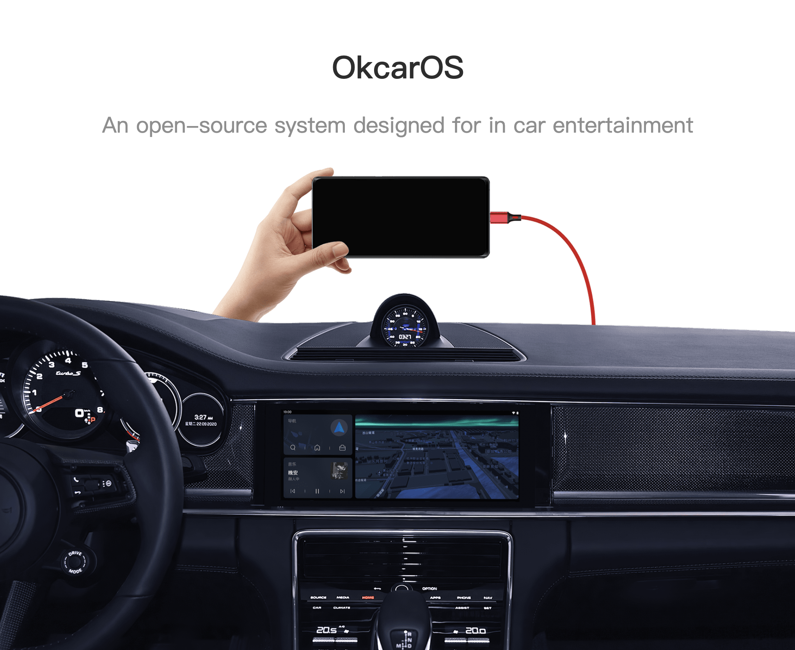
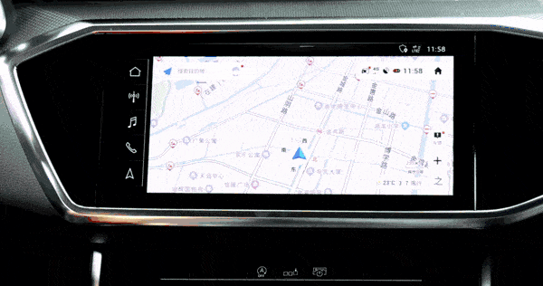

OkcarOS
===========
[中文ReadMe](README_cn.md)


[OkcarOS](https://www.okcaros.com) is an open-source system built on top of [LineageOS](https://github.com/LineageOS)/Android 13, specifically customized for automotive use. It operates on mainstream Android smartphones and facilitates audio, video, and touch data communication with the in-car entertainment by CarPlay protocol. It offers several advantages:

1. Fast connection speed (4~10 seconds)
2. High display compatibility (1:1 resolution matching with the in-car entertainment)
3. Support for video transmission at 60fps frame rate and 25mb bitrate
4. Support for lossless PCM audio transmission at 48000/44100Hz 16-bit stereo

### How to Use

If your in-car entertainment supports CarPlay, all you need is a compatible Android smartphone. Download the OkcarOS ROM package, flash it onto the phone, and connect it to your car:

1. [Official Website](https://www.okcaros.com)
2. [List of Supported Devices](https://wiki.okcaros.com/devices)
3. [ROM Package Download](https://download.okcaros.com)

### Real-life Demonstrations




### Building the System Yourself

If you wish to compile OkcarOS on your own, you should be familiar with [Source Control Tools](https://source.android.com/setup/develop).

Start by fetching the OkcarOS source code locally:

```bash
repo init -u https://github.com/okcar-os/android.git -b okcar-1.0 --git-lfs

# This is a lengthy process, The entire source tree is nearly 183GB when fully downloaded.
repo sync
```

Once the source code is downloaded, you can proceed with compiling OkcarOS following the OkcarOS Build Guide. Compilation is also a time-consuming process; on a computer equipped with an AMD 7950X CPU and 64GB of RAM, it takes approximately 50 minutes. Computers with lower specifications may require several hours or even days for the compilation process.