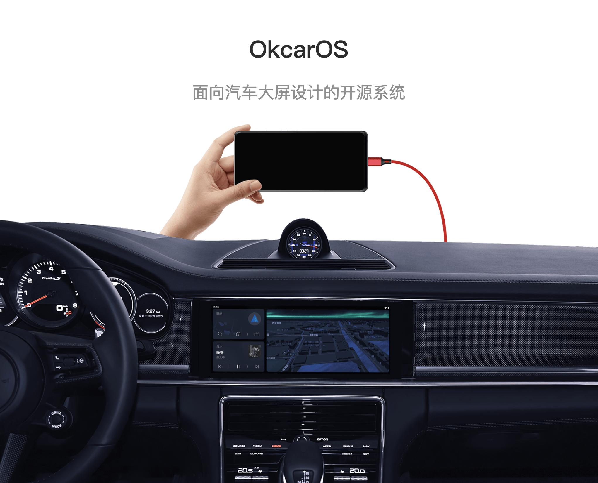

OkcarOS
===========
[OkcarOS](https://www.okcaros.com)是一个基于[LineageOS](https://github.com/LineageOS)/Android 13定制开发的开源系统。它运行在主流Android手机上，通过模拟CarPlay协议与车机进行音频、视频、触摸数据通讯。具备诸多优点：
1. 链接速度快(4~10秒)
2. 显示适配度高(与车机分辨率1:1匹配)
3. 支持60fps帧率、25mb码率的视频传输
4. 支持48000/44100Hz 16bit立体声无损PCM音频传输

如何使用
---------------
如果你的车机支持CarPlay，准备一部支持的Android手机，下载OkcarOS ROM包刷入，插车上即可直接使用。
1. [官网](https://www.okcaros.com)
2. [支持的手机设备列表](https://wiki.okcaros.com/devices)
3. [ROM刷机包下载](https://downaload.okcaros.com)

实拍
---------------


自行编译系统
---------------

如果你想要自己编译OkcarOS系统，你需要熟悉[Source Control Tools](https://source.android.com/setup/develop).

首先需要在本地拉取OkcarOS源码：
```bash
repo init -u https://github.com/okcar-os/android.git -b okcar-1.0 --git-lfs

# 这是一个漫长的过程，你可能需要科学上网，整个源码树全部下完将近183GB
repo sync
```
源码下载完成之后，你就可以根据 [OkcarOS编译教程](https://wiki.okcaros.com/devices/lemonade/build) 进行编译了。编译也是一个漫长的过程，一台使用AMD 7950X CPU，64GB内存的电脑，完成编译大概需要50分钟，配置再差的可能就需要几小时甚至几天。
